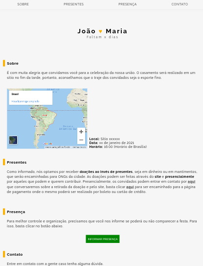
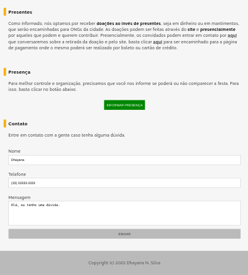
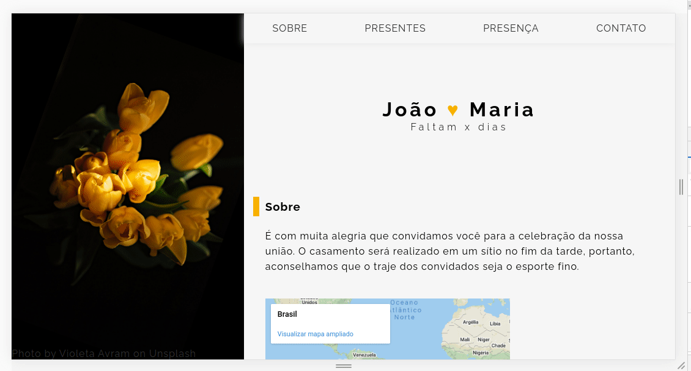

# Site de casamento
Projeto com a finalidade de treinar habilidades relativa as linguagens HTML, CSS e JavaScript. Ele consiste em um site de casamento onde os convidados podem obter informações mais detalhadas sobre o mesmo, confirmar presença e tirar dúvidas.

## Layout
<table>
    <tr>
        <td>
                 
        </td>
        <td>
            
        </td>
    </tr>
</table>


## Linguagens
* CSS
* HTML
* JavaScript

## Executar
**Para executar este pojeto na sua máquina, siga as intruções:**
* execute o seguinte comando no seu terminal: 
``` $ git clone https://github.com/dhayananascimento/casamento.git ```
* abra a pasta que será  criada
* abra o arquivo "index.html" com o navegador de sua preferência
